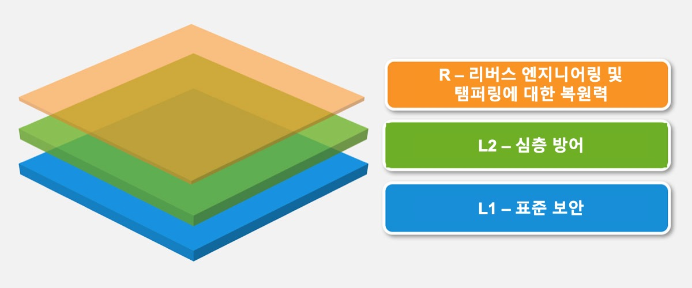

# 모바일 애플리케이션 보안 검증 표준

MASVS를 사용하여 모바일 앱의 보안에 대한 신뢰 수준을 설정하는 데 사용할 수 있습니다. 요구사항은 다음과 같은 목표를 염두에 두고 개발되었습니다:

- 메트릭으로 사용 - 개발자 및 애플리케이션 소유자가 기존 모바일 앱을 비교할 수 있는 보안 표준 제공.
- 지침으로 사용 - 모바일 앱 개발 및 테스트의 모든 단계에 대한 지침 제공.
- 조달 시 사용 - 모바일 앱 보안 검증을 위한 기준 제공.

## 모바일 앱 보안 모델

MASVS는 두 가지 보안 검증 수준(MASVS-L1 and MASVS-L2)과 일련의 리버스 엔지니어링 복원력 요구사항(MASVS-R)을 정의하고 있습니다. MASVS-L1은 모든 모바일 앱에 권장되는 일반적인 보안 요구사항을 포함하고 있으며, MASVS-L2는 매우 민감한 데이터를 처리하는 앱에 적용해야 합니다. MASVS-R은 클라이언트측 위협을 방지하는 것이 설계 목표인 경우에 적용할 수 있는 추가 보호 요구사항을 다루고 있습니다.

MASVS-L1의 요구사항을 충족하면 보안 모범 사례에 따라 일반적인 취약점이 없는 보안 앱이 생성됩니다. MASVS-L2는 SSL 적용과 같은 심층 방어 제어를 추가하여 보다 정교한 공격에 내성이 있는 앱을 제공합니다. 모바일 운영체제의 보안 제어에 문제가 없고 최종 사용자가 잠재적인 공격자로 간주되지 않는다고 가정합니다. MASVS-R의 소프트웨어 보호 요구사항 전부 또는 일부를 충족하면 최종 사용자가 악의적이거나 모바일 OS가 손상되는 특정 클라이언트측 위협을 방지할 수 있습니다.

**I: 모든 앱에서 MASVS-L1 제어를 구현하는 것을 권고하지만, 제어권 구현은 궁극적으로 비즈니스 소유자와 의사 소통을 통해 위험 기반으로 결정되어야 합니다.**

**II: MASVS-R에 나열되고 OWASP Mobile Security Testing Guide에 설명된 소프트웨어 보호 제어는 궁극적으로 우회될 수 있으며, 보안 제어의 대체 수단으로 사용되어서는 안됩니다. 대신 MASVS-L1 또는 MASVS-L2의 MASVS 요구사항을 충족하는 앱에 위협 관련 보호 제어를 추가하기 위한 것입니다.**

### 문서의 구성

MASVS의 첫 번째 부분에는 보안 모델과 사용 가능한 검증 수준에 대한 설명이 수록되어 있으며, 그 다음이 실제로 표준을 사용하는 방법에 대한 권고사항입니다. 검증 수준에 대한 맵핑과 함께 자세한 보안 요구사항이 두 번째 파트에 나열되어 있습니다. 요구사항은 기술적 목표/범위를 기준으로 8개 범주(V1 ~ V8)로 분류되어 있습니다. MASVS 및 MSTG 전체에서 다음과 같은 명명법이 사용됩니다:

- *요구사항 카테고리:* MASVS-Vx, 예. MASVS-V2: 데이터 스토리지 및 개인정보보호
- *요구사항:* MASVS-Vx.y, 예. MASVS-V2.2: "민감한 데이터는 애플리케이션 로그에 기록되지 않습니다."  

### 세부 검증 수준

#### MASVS-L1: 표준 보안

MASVS-L1을 달성한 모바일 앱은 모바일 애플리케이션 보안 모범 사례를 준수합니다. 코드 품질, 민감한 데이터 처리 및 모바일 환경과의 상호작용 측면에서 기본 요구사항을 충족합니다. 보안 통제를 확인하기 위한 테스트 프로세스가 있어야 합니다. 이 수준은 모든 모바일 애플리케이션에 적합합니다.

#### MASVS-L2: 심층 방어

MASVS-L2에는 표준 요구사항을 능가하는 고급 보안 제어 기능이 도입되었습니다. MASVS-L2를 충족하려면 위협 모델이 존재해야하며 보안은 앱 아키텍처와 디자인에 필수적인 부분이어야 합니다. 위협 모델을 기반으로 올바른 MASVS-L2 컨트롤을 선택하고 성공적으로 구현해야 합니다. 이 수준은 모바일 뱅킹 앱처럼 매우 민감한 데이터를 처리하는 앱에 적합합니다.

#### MASVS-R: 리버스 엔지니어링 및 탬퍼링에 대한 복원력

이 앱은 최첨단 보안을 갖추고 있으며, 민감한 코드나 데이터를 추출하기 위해 변조, 위조, 역공학 등 구체적이고 명확하게 정의된 클라이언트측 공격에 대해서도 탄력적입니다. 이러한 앱은 하드웨어 보안 기능 또는 충분히 강력하고 검증 가능한 소프트웨어 보호 기술을 활용합니다. MASVS-R은 매우 민감한 데이터를 처리하는 앱에 적용할 수 있으며 지적 재산을 보호하거나 앱을 조작 방지하는 수단으로 사용될 수 있습니다.

### 권장 사용

애플리케이션은 사전 위험 평가 및 필요한 전반적인 보안 수준에 근거하여 MASVS L1 또는 L2에 대해 검증할 수 있습니다. L1은 모든 모바일 앱에 적용할 수 있지만 L2는 일반적으로보다 민감한 데이터 또는 기능을 처리하는 앱에 권장됩니다. MASVS-R(또는 그 일부)을 적용하면 적절한 보안 검증 외에도 추가적으로 민감한 데이터의 리패키징 또는 추출과 같은 특정 위협에 대한 복원력을 검증할 수 있습니다.

요약하면 다음과 같은 검증 유형을 사용할 수 있습니다:

- MASVS-L1
- MASVS-L1+R
- MASVS-L2
- MASVS-L2+R

다른 조합은 다른 등급의 보안 및 복원력을 반영합니다. 목표는 유연성을 허용하는 것입니다: 예를 들어, 모바일 게임은 사용 적합성 이유로 2단계 인증과 같은 MASVS-L2 보안 통제장치를 추가하는 것을 보증하지 않을 수 있지만, 조작 방지에 대한 강력한 비즈니스 요구가 있을 수 있습니다.

#### 선택할 검증 유형

MASVS L2의 요구사항을 구현하면 보안이 향상되는 동시에 개발 비용이 증가하고 최종 사용자 경험이 악화될 수 있습니다.(전통적인 절충) 일반적으로 L2는 위험 대비 비용 관점에서 의미가 있을때 앱에 사용해야 합니다.(즉, 기밀성 또는 무결성의 타협으로 인한 잠재적 손실이 추가 보안 통제에서 발생하는 비용보다 더 큰 경우) MASVS를 적용하기 전에 위험평가가 첫 번째 단계이여야 합니다.

##### 사례

###### MASVS-L1

- 모든 모바일 앱. MASVS-L1에는 개발 비용 및 사용자 경험에 합리적인 영향을 줄 수 있는 보안 모범 사례가 나와 있습니다. 상위 레벨 중 하나에 해당하지 않는 앱에 대해서는 MASVS-L1의 요구사항을 적용하십시오.

###### MASVS-L2

- 헬스케어 산업: 신분 도용, 사기 지불 또는 다양한 범죄 행위에 사용할 수 있는 개인 식별 정보를 저장하는 모바일 앱. 미국 의료 부문의 경우 규정 준수 고려 사항에는 미국의 의료보험의 양도 및 책임에 관한 법률(HIPAA)의 개인정보보호, 보안, 위반 통지 규칙 및 환자 안전 규칙이 포함됩니다.

- 금융 산업: 신용카드번호, 개인정보와 같이 매우 민감한 정보에 액세스하거나 사용자가 송금할 수 있는 앱. 이러한 앱은 사기를 방지하기 위해 추가 보안 제어를 보장해야 합니다. 금융 앱은 신용카드업계 데이터 보안 표준(PCI DSS), 금융서비스현대화법(그램 리치 블라일리법, Gramm Leach Bliley Act) 및 사베인-옥슬리법(Sarbanes-Oxley Act, SOx)를 준수해야 합니다.

###### MASVS L1+R

- 지적재산권(IP) 보호가 비즈니스 목표인 모바일 앱. MASVS-R에 나열된 복원력 제어는 원래 소스코드를 획득하는 데 필요한 노력을 증가시키고 위변조를 방해하기 위해 사용할 수 있습니다.

- 게임 산업: 경쟁력있는 온라인 게임과 같이 부정행위를 방지하는 데 필수적인 필요가 있는 게임. 부정행위는 많은 양의 사기꾼이 불만을 가진 플레이어 기반으로 이어져 궁극적으로 게임이 실패할 수 있기 때문에 온라인 게임에서 중요한 문제입니다. MASVS-R은 부정행위자의 부담을 증가 시키기 위해 기본적인 변조 방지 컨트롤을 제공합니다.

###### MASVS L2+R

- 금융 산업: 사용자가 송금할 수 있는 온라인 뱅킹 앱으로, 코드 삽입이나 손상된 장치의 계측과 같은 기술이 위험에 노출될 수 있습니다. 이 경우 MASVS-R의 컨트롤을 사용하여 조작을 방해하여 맬웨어 작성자의 부담을 증가 시킬 수 있습니다.

- 설계상 민감한 데이터를 모바일 장치에 저장해야하는 동시에 모든 장치와 운영체제 버전을 지원해야하는 모든 모바일 앱. 이 경우 복원력 제어는 민감한 데이터 추출을 목표로하는 공격자의 노력을 증가시키기 위한 심층 방어 수단으로 사용될 수 있습니다.

- 앱내 구매 기능이 있는 앱은 유료 콘텐츠를 보호하기 위해 서버측 및 MASVS-L2 제어를 이상적으로 사용해야 합니다. 단, 서버측 보호를 이용할 가능성이 없는 경우가 있을 수 있습니다. 이 경우 리버싱 또는 변조 방지력을 높이기 위해 MASVS-R 컨트롤을 추가로 적용해야 합니다.
